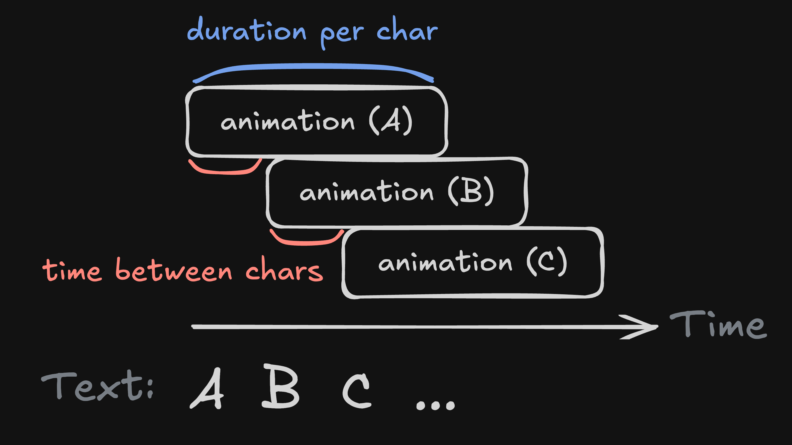
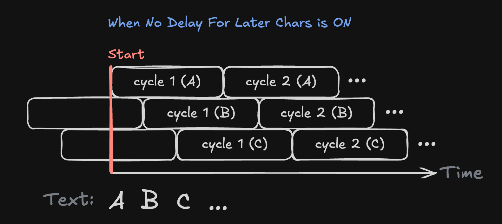
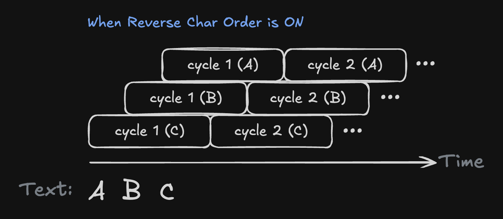
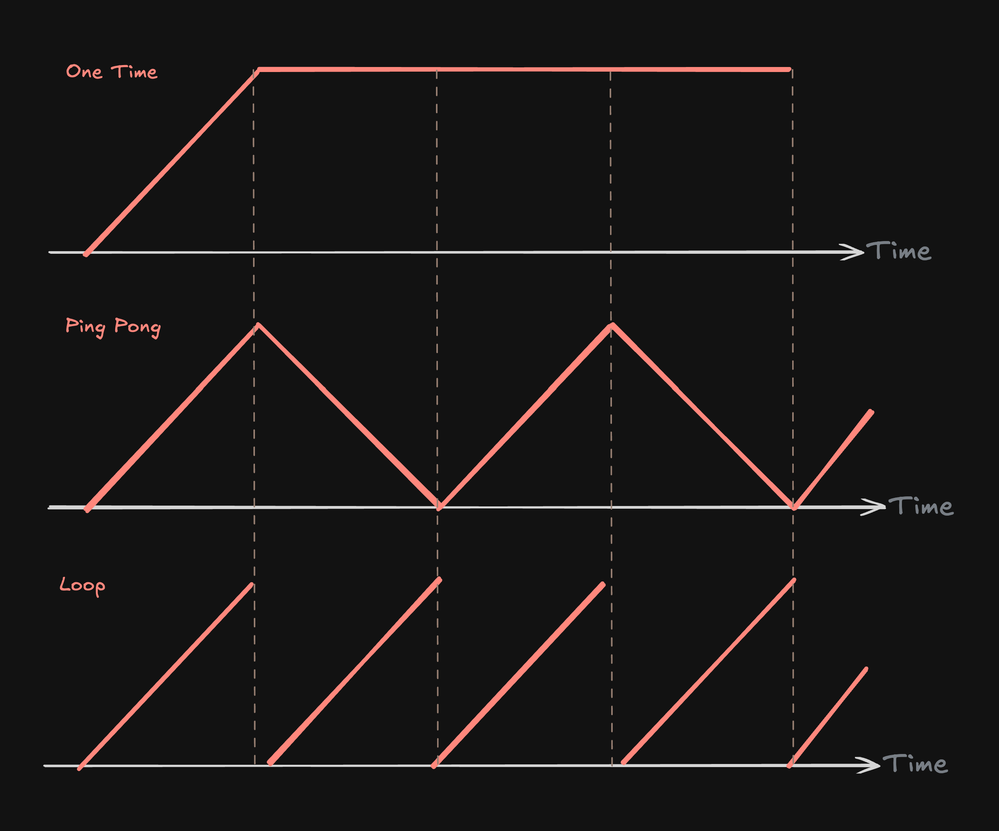

# Documentation

## Installation

Easiest way is to [install Easy Text Effects as a package](https://docs.unity3d.com/Manual/upm-ui-giturl.html).

1. Open **Window/Package Manager** in Unity.
2. Click on the **+** button in the top left corner.
3. Select **Add package from git URL** and paste the following URL:

```
https://github.com/LeiQiaoZhi/Easy-Text-Effect.git
```

> If you are new to this package, I highly recommend you to import the samples in the "**Samples**" tab in the [details panel](https://docs.unity3d.com/6000.0/Documentation/Manual/upm-ui-details.html) of this package in the package manager. There is a demo scene and some ready-to-use effects.

### Dependencies

This package only works with **TextMeshPro**. 

**MyBox** is used for some inspector utilities. It should automatically be installed when you install this package. If not, you can install it from [github url](https://github.com/Deadcows/MyBox.git).

## Getting Started

Animate your text with 3 simple steps:

1. Add a `TextEffect` component, drag your `TMP Text` component to the `Text` field.
2. Create a new effect in the project view, by right-clicking and selecting
   `Create/Easy Text Effect/[Text Effect Type]`.
3. Add an element to an effect list, then drag the effect to the `Effect` field.

>You should see your effects right away in the editor! (_If not, press the **Refresh** button, or **Play** the scene._)

See the [Effects](#effects) page for more information on the available effects.


## Effects

There are 6 types of effects: `Color`, `Move`, `Rotate`, `Scale`, `Composite`, and `Per Vertex`.

> Note that TMP already has built-in effects like textures, outlines, fake 3D, drop shadows, etc. 

### Common Properties

There are some common properties that are shared between all effects:

`Effect Name`: The name of the effect, used to identify the effect for rich text tags and manual control.

Animations' timing are different for each character:
- `Duration Per Char`: The duration of one cycle of the effect for each character.
- `Time Between Chars`: The time between the start of each character's effect. You can set it to 0 to make the effect text-wise.



`No Delay For Later Chars`: If enabled, the effect will start immediately for all characters, instead of waiting for the previous character to finish.



`Reverse Char Order`: If enabled, the effect will start from the last character instead of the first. This is useful for exit animations.



`Animation Type`: determines how the effect acts when time exceeds the duration of the effect.
- `One Time`: The effect will **stop** when the time exceeds the duration. All other types will loop (in different ways).  
- `Ping Pong`: The effect will **reverse** when the time exceeds the duration. This makes the effect go back and forth smoothly.
- `Loop`: The effect will **restart** when the time exceeds the duration. If start and end values are not the same, the effect will have an abrupt jump.





### Color

The `Color` effect allows you to animate the color of the text. You can choose between different color types:
- `Gradient`: Applies a gradient to the text.
- `BetweenTwoColors`: Animates between two colors.
- `OnlyAlpha`: Animates only the alpha (transparency) of the text.
- `ColorToOriginal`: Animates from a color to the original color of the text.

When using `Gradient`, you can set orientation (Horizontal, HorizontalPerCharacter, Vertical).

Example:

### Move

Example: wavy text

### Rotate

### Scale

### Per Vertex

### Composite

Only have `EffectName` and a list of effects. This is useful for combining multiple effects into one.

This is for organizational purposes only, and does not have any properties of its own. It is the same as adding multiple effects to the same list.

This can be useful if there is a common set of effects that you want to apply to multiple texts. For example, you can create a composite entry animation that contains a fade in and a move up effect, and apply it to multiple texts.

### Creating Effects

Effects are ScriptableObjects that can be created in the project view. Right-click and select `Create/Easy Text Effect/[Text Effect Type]`. Since effects are assets, they can be shared between multiple `TextEffect` components, and changes to the effect will be reflected in all components.

### Applying Effects

There are 2 effect lists:

- `Tag Effects`: Effects that are applied to the text based on rich text tags.
- `Global Effects`: Effects that are applied to every character in the text.

Global effects are very easy to apply, just add an element to the list and drag the effect to the `Effect` field.

Tag effects are applied by adding a rich text tag to the text. The format is `<link=effectName>text</link>`. The `effectName` should match the `Effect Name` of the effect.

> Using `link` is a workaround to make the tag work without writing a custom tag parser. 

> Note that there are already some built-in tags in TextMeshPro, like `<color=#ff0000>red</color>`, `<size=20>big</size>`, etc.

### Controlling Effects

Every element of an effect list has a `Trigger When` field, which determines when the effect is triggered. 
- `On Start`: The effect will start when the text is enabled.
- `Manual`: The effect will start only when a script tells it to.
   - `StartAllManualEffects()`: start all manual effects in the global list.
   - `StartManualEffects(string effectName)`: start the manual effect with the given name in the global list.
   - `StartManualTagEffects()`: start all manual effects in the tag list.
   - `StartManualTagEffects(string effectName)`: start the manual effect with the given name in the tag list.

There are some debug buttons to help you test manual effects in the editor:


### Creating Your Own Effects

The easiest way to create your own effects is to create a new class that inherits from `TextEffect_Trigger` and override the `ApplyEffect` method.

Example:

```csharp
using EasyTextEffects.Effects;
using TMPro;

[CreateAssetMenu(menuName = "Easy Text Effects/Customized Effect")]
public class CustomizedEffect : TextEffect_Trigger
{
    public override void ApplyEffect(TMP_TextInfo _textInfo, int _charIndex)
    {
        // Your code here   
    }
}
```

Look at the existing effects in `Packages/EasyTextEffects/Runtime/Effects` for more examples.

Limitations:
- You can only change the vertices and colors of the text. 
- Inherited properties will show up in the inspector, even if you don't use them. You need to write your own editor script to hide them, see `Packages/EasyTextEffects/Editor/CompositeEffectEditor.cs` for an example.