# 📖 Documentation

Table of Contents
1. [Installation](#installation)
2. [Quick Start](#quick-start)
3. [Effects](#effects)
4. [Samples](Samples.md)

## 📦 Installation

The easiest way is to [install Easy Text Effects as a package](https://docs.unity3d.com/Manual/upm-ui-giturl.html).

1. Open **Window/Package Manager** in Unity.
2. Click on the **+** button in the top left corner.
3. Select **Add package from git URL** and paste the following URL:

```
https://github.com/LeiQiaoZhi/Easy-Text-Effect.git
```

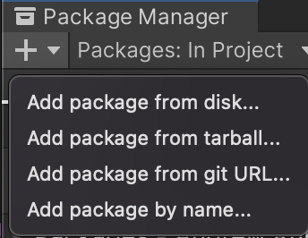

<br>

> If you are new to this package, I highly recommend you to import the samples in the "**Samples**" tab in the details panel of this package in the package manager. There is a demo scene and some ready-to-use effects. See [Samples](Samples.md) for more information.

This package is also on OpenUPM: [](https://openupm.com/packages/com.qiaozhilei.easy-text-effects/).


### Dependencies

This package only works with **TextMeshPro**. 

> Make sure your project has imported "TextMeshPro Essential Resources" in menubar `Window/TextMeshPro/Import TMP Essential Resources`.

## 🚀 Quick Start

Animate your text with 3 simple steps:

1. Add a  `TextEffect` component, drag your `TMP Text` component to the `Text` field.
2. Create a new effect in the project view, by right-clicking and selecting
   `Create/Easy Text Effect/[Text Effect Type]`.
    - or use ready-to-use effects from [samples](Samples.md)
3. Add an element to an effect list, then drag the effect to the `Effect` field.

> You should see your effects right away in the editor! (_If not, press the **Refresh** button, or **Play** the scene._)
> 
> ⚠️ Right now the edit mode preview doesn't work smoothly in Unity 6, please use play mode to see the effects.

See the [Effects](#effects) page for more information on the available effects.

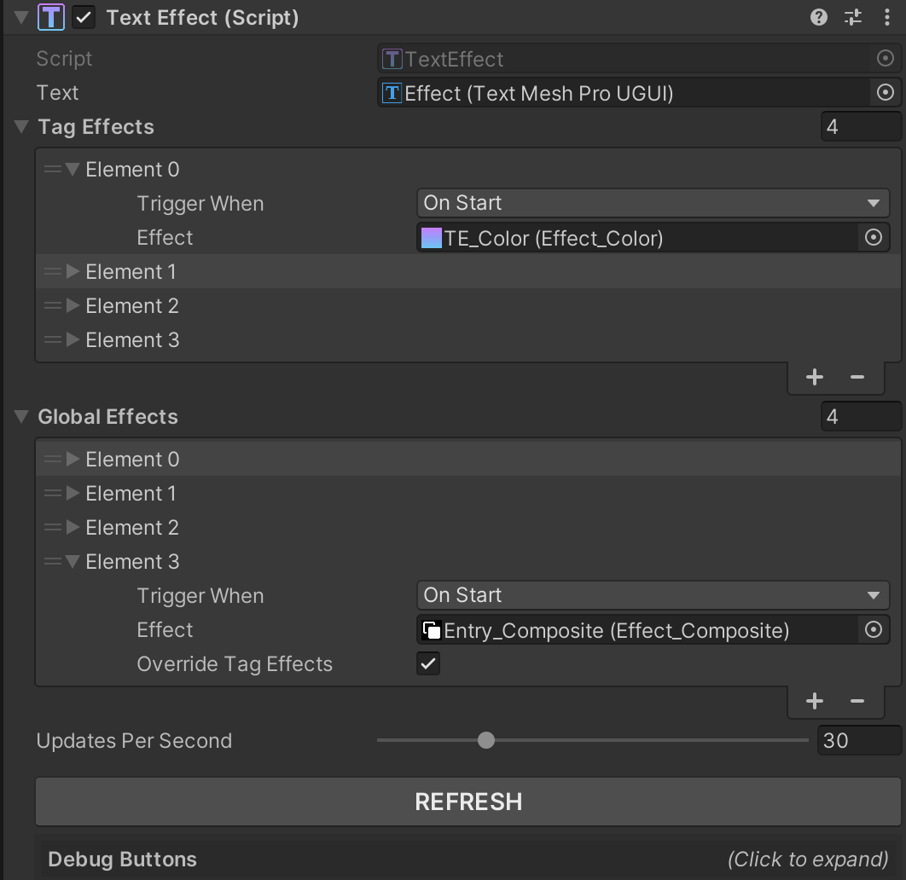


## ✨ Effects

- [Common Properties](#common-properties)
- 6 types of effects: [Color](#color), [Move](#move), [Rotate](#rotate), [Scale](#scale), [Per Vertex](#per-vertex), and [Composite](#composite)
- [Creating Effects](#creating-effects)
- [Applying Effects](#applying-effects)
- [Controlling Effects](#controlling-effects)
- [Creating Your Own Effects](#creating-your-own-effects)

> Note that TMP already has built-in effects like textures, outlines, fake 3D, drop shadows, etc. 

### Common Properties

There are some common properties that are shared between all effects:

`Effect Name`: The name of the effect, used to identify the effect for rich text tags and manual control.

Animations' timing are different for each character:
- `Duration Per Char`: The duration of one cycle of the effect for each character.
- `Time Between Chars`: The time between the start of each character's effect. You can set it to 0 to make the effect text-wise.

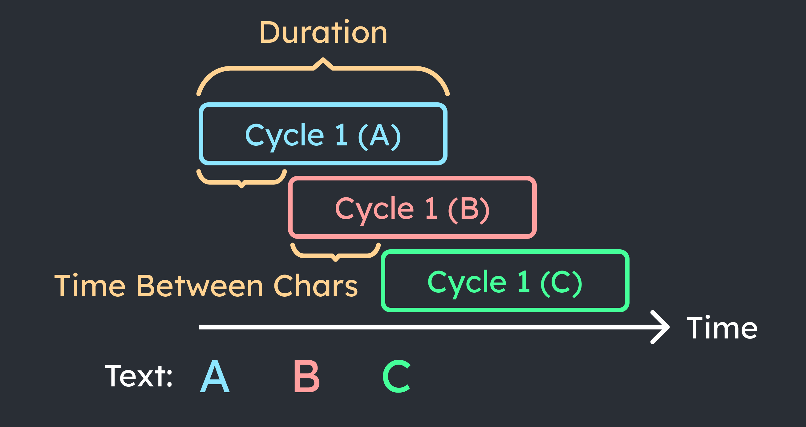

`No Delay For Later Chars`: If enabled, the effect will start immediately for all characters, instead of waiting for the previous character to finish.

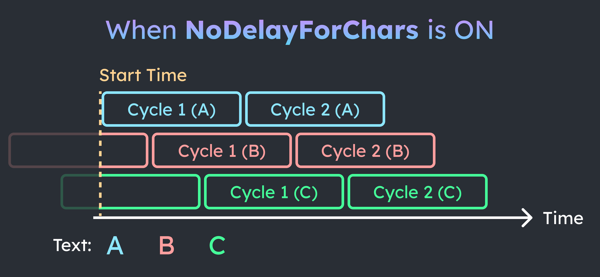

`Reverse Char Order`: If enabled, the effect will start from the last character instead of the first. This is useful for exit animations.

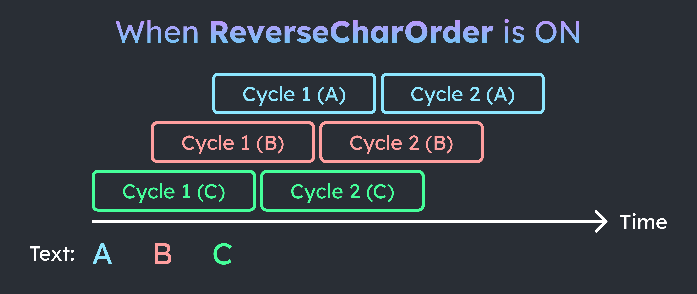

`Animation Type`: determines how the effect acts when time exceeds the duration of the effect.
- `One Time`: The effect will **stop** when the time exceeds the duration. All other types will loop (in different ways).  
- `Ping Pong`: The effect will **reverse** when the time exceeds the duration. This makes the effect go back and forth smoothly.
- `Loop`: The effect will **restart** when the time exceeds the duration. If start and end values are not the same, the effect will have an abrupt jump.
- `LoopWithFixedTime`: Like `One Time`, but all characters restarts after a fixed time. 

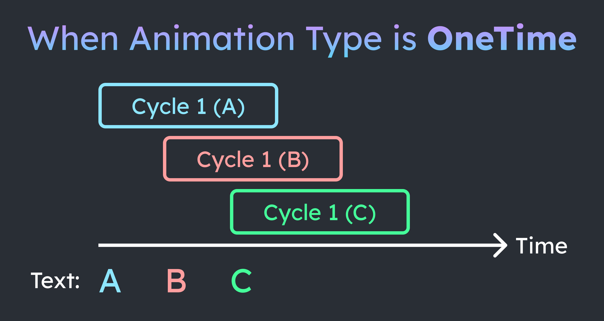

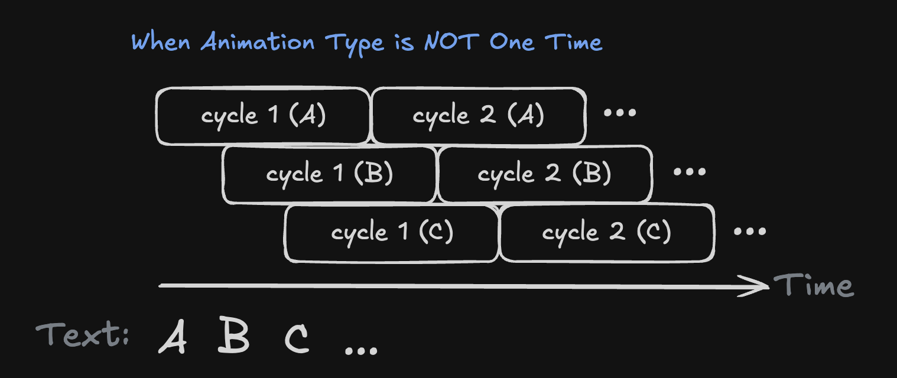

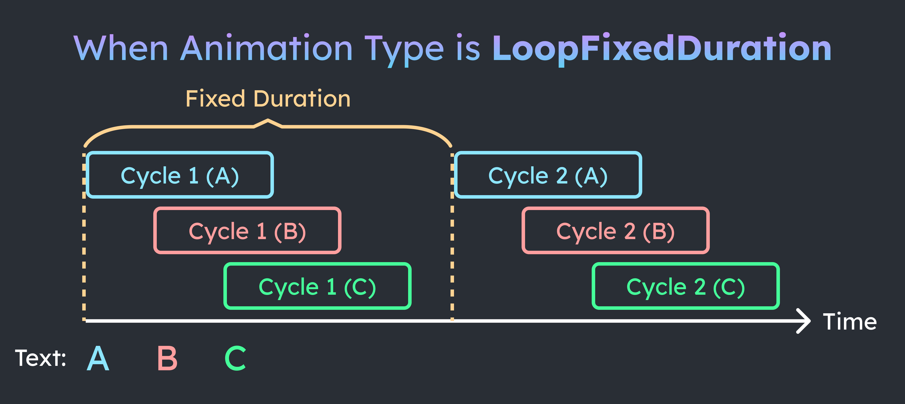

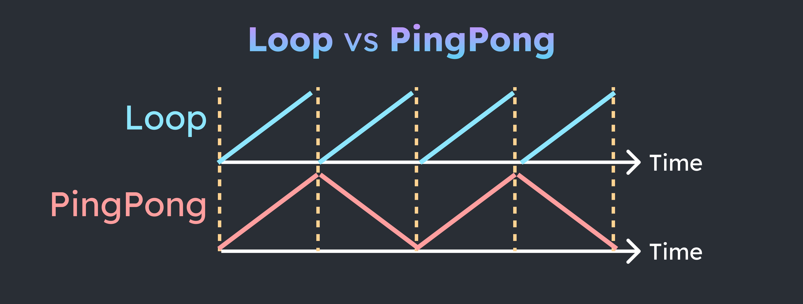


### Color


Example: color effects in "Ready-to-use Effects" [sample](Samples.md). 

The `Color` effect allows you to animate the color of the text. You can choose between different color types:
- `Gradient`: Applies a gradient horizontally across the text.
- `BetweenTwoColors`: Animates between two colors.
- `OnlyAlpha`: Animates only the alpha (transparency) of the text.
- `ColorToOriginal`: Animates from a start color to the original color of the text.
- `OriginalToColor`: Animates from the original color of the text to an end color.


When using `Gradient`, you can set orientation (Horizontal, HorizontalPerCharacter, Vertical).
- `Horizontal`: There is NO color variation inside a character.
- `HorizontalPerCharacter`: There is horizontal color variation inside a character. The difference between the left and right side of the character is controlled by the `stride` property.
- `Vertical`: same as `HorizontalPerCharacter`, but the color variation is vertical.


### Move


Example: movement effects in "Ready-to-use Effects" [sample](Samples.md). 

The `Move` effect allows you to animate the position of the text. You can specify the `startOffset` and `endOffset` of the movement.


### Rotate

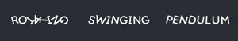

Example: rotate effects in "Ready-to-use Effects" [sample](Samples.md). 

The `Rotate` effect allows you to animate the rotation of the text. You can specify the `startAngle` and `endAngle` of the rotation.

### Scale


Example: scaling effect in "Ready-to-use Effects" [sample](Samples.md). 

The `Scale` effect allows you to animate the scale of the text. You can specify the `startScale` and `endScale` of the scaling.

### Per Vertex

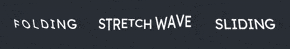

Example: per-vertex effects in "Ready-to-use Effects" [sample](Samples.md). 

Per-vertex effects allow you to assign a different effect to each vertex of the text. This allows for more complex animations. 

Explanation of examples:
- `Folding`: Top left and bottom right vertices do not have any effect, while the other vertices are scaling. 
- `Stretch Wave`: The top vertices are using the `Bounce` effect, the bottom vertices are using the `Wave` effect.
- `Sliding`: All vertices are moving horizontally, but top and bottom vertices are moving in opposite directions.

### Composite

Only have `EffectName` and a list of effects. This is useful for combining multiple effects into one.

This is for organizational purposes only, and does not have any properties of its own. It is the same as adding multiple effects to the same list.

This can be useful if there is a common set of effects that you want to apply to multiple texts. For example, you can create a composite entry animation that contains a fade in and a move up effect, and apply it to multiple texts.

### Creating Effects

Effects are ScriptableObjects that can be created in the project view. Right-click and select `Create/Easy Text Effect/[Text Effect Type]`. Since effects are assets, they can be shared between multiple `TextEffect` components, and changes to the effect will be reflected in all components.

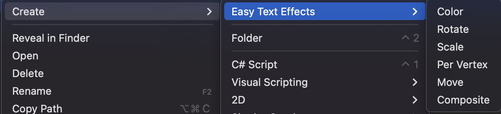

<br/>

> To use ready-to-use effects, see the [Samples](Samples.md) page.

### Applying Effects

There are 2 effect lists:

- `Tag Effects`: Effects that are applied to the text based on rich text tags.
- `Global Effects`: Effects that are applied to every character in the text.

**Global effects** are very easy to apply, just add an element to the list and drag the effect to the `Effect` field.
- The option `overrideTagEffects` determines whether a global effect override tag effects or not.

**Tag effects** are applied by adding a rich text tag to the text. The format is `<link=effectName>text</link>`. The `effectName` should match the `Effect Name` of the effect.
- When adding multiple tag effects, the format is `<link=effectName1+effectName2>text</link>`. Don't include "+" in effect names for this reason.

> Using `link` is a workaround to make the tag work without writing a custom tag parser. 

> Note that there are already some built-in tags in TextMeshPro, like `<color=#ff0000>red</color>`, `<size=20>big</size>`, etc.

### Controlling Effects

Every element of an effect list has a `Trigger When` field, which determines when the effect is triggered. 
- `On Start`: The effect will start when the text is enabled.
- `Manual`: The effect will start only when a script tells it to.
   - `StartManualEffects()`: start all manual effects in the global list.
   - `StartManualEffects(string effectName)`: start the manual effect with the given name in the global list.
   - `StartManualTagEffects()`: start all manual effects in the tag list.
   - `StartManualTagEffects(string effectName)`: start the manual effect with the given name in the tag list.
   - There are also corresponding `Stop` methods. For implmentations, look at `Runtime\TextEffect.cs`.

There are some debug buttons to help you test manual effects in the editor:

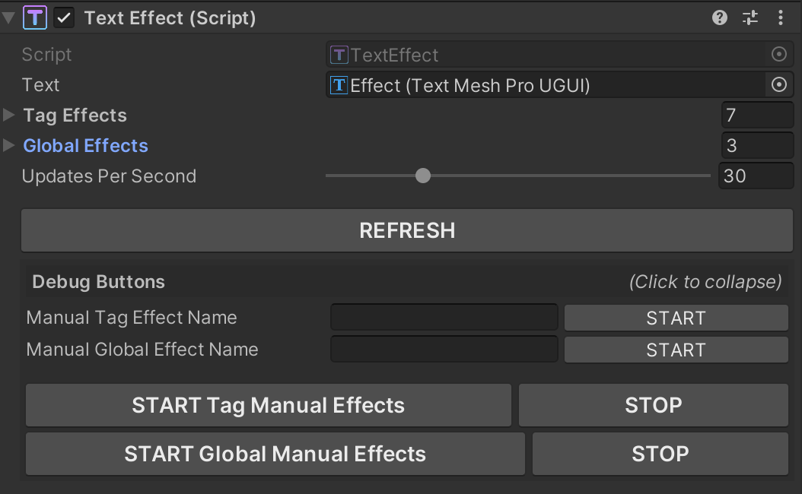

> If you have added/changed the effects during runtime and your text isn’t behaving correctly, you may want to call `textEffectScript.Refresh()`​ before calling the start effects methods. 

#### Query Effect Statuses

An effect status consists of `Tag`, `Started`, `IsCompleted`.
- note that `IsCompleted` is only true for `One Time` and `Loop Fixed Duration` animations. 
- special cases: `IsCompleted` becomes true once any child effect in composite or per-vertex effects is completed. 

You can see the statuses of all the effects in the inspector in real time!

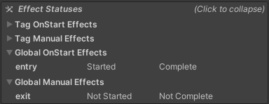

If you want to know the status of the effects in code, you can use the following methods:
- `List<TextEffectStatus> QueryEffectStatuses(TextEffectType _effectType,
            TextEffectEntry.TriggerWhen _triggerWhen)`
- `List<TextEffectStatus> QueryEffectStatusesByTag(TextEffectType _effectType,
            TextEffectEntry.TriggerWhen _triggerWhen, string _tag)`

#### On Effect Completed Event

There is a `On Effect Completed` event for each effect in the effect list. This event will be triggered when the effect is completed, but note that this only works for `One Time` and `Loop Fixed Duration` animations.


For a detailed tutorial, see [Chain Animations](Tutorials/Chain%20Animations.md).

### Creating Your Own Effects

The easiest way to create your own effects is to create a new class that inherits from `TextEffect_Trigger` and override the `ApplyEffect` method.

Example:

```csharp
using EasyTextEffects.Effects;
using TMPro;

[CreateAssetMenu(menuName = "Easy Text Effects/Customized Effect")]
public class CustomizedEffect : TextEffect_Trigger
{
    public override void ApplyEffect(TMP_TextInfo _textInfo, int _charIndex)
    {
        // Your code here   
    }
}
```

Look at the existing effects in `Packages/EasyTextEffects/Runtime/Effects` for more examples.

Limitations:
- You can only change the vertices and colors of the text. 
- Inherited properties will show up in the inspector, even if you don't use them. You need to write your own editor script to hide them, see `Packages/EasyTextEffects/Editor/CompositeEffectEditor.cs` for an example.