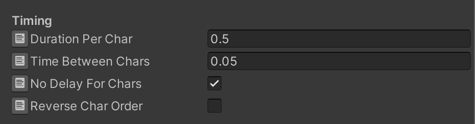
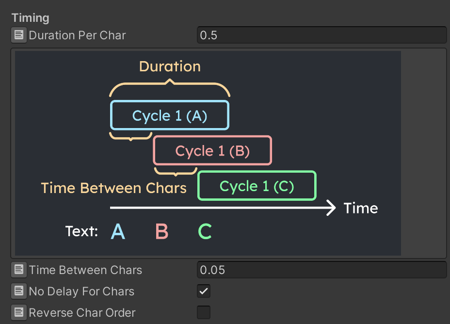

# Embedded Documentation

> Read documentation directly inside inspector. There is no need to open another window!

⚠️ this feature is disabled in versions before 2022.3

If you see an icon on the left of a field, you can click it to expand a helpbox that explains it. 

Think of it as the default hover tooltips, but can show images and more readable.

⬇︎ after clicking on the icon

