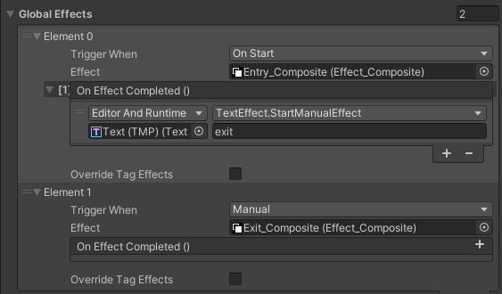
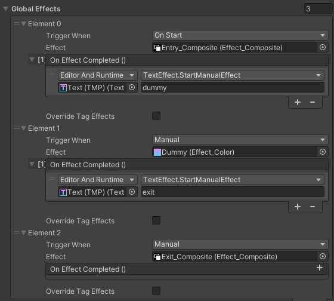

# Tutorial: Chaining Animations

You can easily chain animations so one starts after another finishes -- all without writing code. Here’s how:

## Example

This example shows a text playing an entry animation, immediately followed by an exit animation:

Steps:

1. Create the entry and exit animations, refering to [documentation on creating effects](../Documentation.md#creating-effects).
    - ⚠️ the animation type for the 2 animations must be `One Time`.

2. Add a `Text Effect` component to the TMP text object. 

3. Add 2 effects to the global effects list: the entry and exit animations.
    - For the entry animation, set Trigger When to `On Start`.
    - For the exit animation, set Trigger When to `Manual`, since we want to manually trigger it when the entry animation has finished.
    - Add an event to the `On Effect Completed` event of the entry animation, and set it to trigger the exit animation. Since it is an Unity event, you can simply drag the `Text Effect` component in and select the `StartManualEffect` method and pass the tag of the exit animation. (*in the example, the tag is `exit`*)

 

> 💡 Tip: To see chaining in Edit Mode, set the events to Editor and Runtime.

> 📝 Note: The On Effect Completed Unity event is versatile and can trigger any method in any script, enabling synchronized game events with text animations.

## Adding a Delay

If we don't want the exit animation to start immediately after the entry animation, we can add a delay to the exit animation.

We can think of the delay as an animation that is doing nothing, bascically a "Dummy" animation.

Steps:

1. Create a Dummy Animation:
	- Use any animation type (e.g., "Color") and set Start and End values to the same.
	- Set:
	    - Time Between Chars to 0.
	    - Duration Per Char to the desired delay time.

2. Chain Animations:
	- Link entry → dummy → exit animations in the same way as before.

