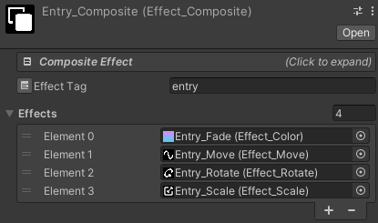

# Tutorial: Typewriter Effect

You can easily create a typewriter effect with Easy Text Effects. Here's how:

A typewriter effects animates characters one by one, with a uniform delay between each character.

Steps:
1. Add a `Text Effect` component to the TMP text object.
2. Create a color effect by right-clicking in the project window and selecting `Create > Easy Text Effects > 1. Color`.
3. Configure the color effect like the screenshot below:

	- Animation type should be `One Time`, since we want the effect to play only once.
	- Important settings for the timing are `Duration Per Char` and `Time Between Chars`. If you set `Duration Per Char` close to 0 (like 0.001), each character will appear almost instantly. If you set `Time Between Chars` to 0, all characters will appear at once, which is not a typewriter effect.
	- Color type should be `Only Alpha`, since alpha controls the visibility of the characters.

## Getting Fancy

You can make the typewriter effect more interesting by combining it with other effects. For example, you can let the texts change color, move upwards, rotate, and scale up as they appear.

Lastly, you can put the different effects into a composite effect, so you only need to drag and drop one effect onto the `Text Effect` component.

