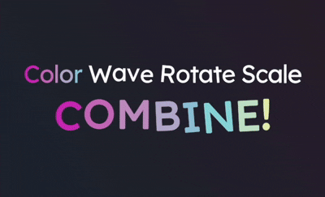
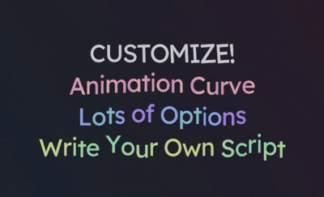
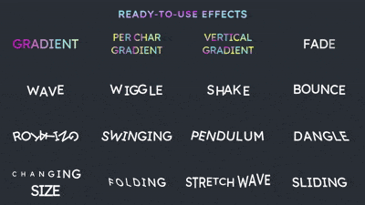
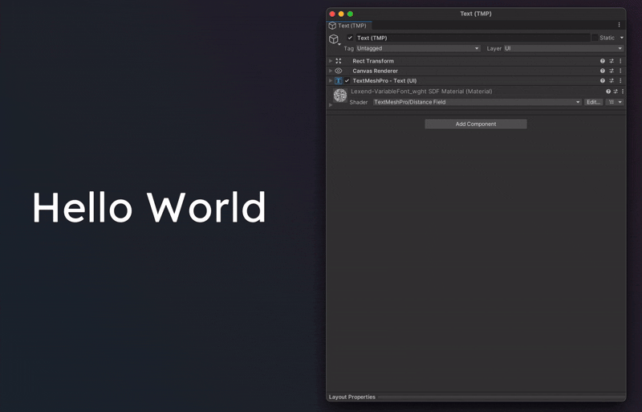
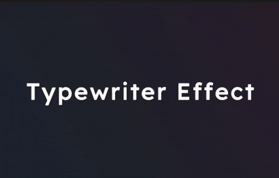

<h1>
     
    Easy Text Effects for Unity
</h1>

  

> **Easily animate TextMeshPro text with stunning, customizable effects!**

**Easy Text Effects** is a free and open-source Unity package that brings life to your text. Whether you're working on games, UI, or interactive experiences, this package provides an intuitive and flexible way to create captivating text animations.

[**📦 Install from GitHub url**](Documentation/Documentation.md#installation)

|  |  |  |
|----------------------------------------------|------------------------------------------|--------------------------------------------------|

## ✨ Features

- **Effortless Setup**: Attach a single component, create effects as ScriptableObjects, and apply with drag-and-drop.
- **Customizable Animations**: Use animation curves and a variety of parameters for unique, fine-tuned effects.
- **Per-Vertex Effects**: Animate individual text vertices for detailed and dynamic visuals.
- **Ready-to-Use Samples**: Kickstart your creativity with a library of pre-made effects.
- **Real-Time Previews**: See your effects in the edit mode.

## 🚀 Quick Start

1. [**Install the package**](Documentation/Documentation.md#installation).
2. Add the **Text Effect Component** to your TextMeshPro object.
3. Create an **Effect ScriptableObject** and configure the parameters.
4. Drag and drop your effect onto the component.
5. See you effect in the edit mode right away!

For detailed steps, visit the [Quick Start Guide](Documentation/Documentation.md#quick-start).

## 📚 Learn More

- [**Simple and Clear Documentation**](Documentation/Documentation.md)
- [**Read Documentation Directly in Inspector!**](Documentation/EmbeddedDocumentation.md)
- [Samples](Documentation/Samples.md)

## 🛠️ Customization

Unleash your creativity with:

- **Animation Curves**: Control timing, speed, and intensity.
- [**Per-Vertex Effects**](Documentation/Documentation.md#per-vertex): Animate individual letters for dynamic text effects.
- [**Combine Effects**](Documentation/Documentation.md#composite): Create complex animations with composite effects.

## ❔ How to ...

- **Typewriter Effect?** Absolutely! See [Tutorial: Typewriter Effect](Documentation/Tutorials/Typewriter.md).
- **Chain animations?** Absolutely! See [Tutorial: Chaining Animations](Documentation/Tutorials/Chain%20Animations.md).
- If you are still unsure after reading the documentation, feel free to ask anywhere (dm, email, issue, etc.).

| Typewriter Effect | Chain Animations |
|----------------------------------------------|------------------------------------------|
|  |  | 

## 🤝 Contributing

Found a bug or have a feature request? Open an issue or submit a pull request! Contributions are welcome.

## 📃 License

This project is licensed under the MIT License. See the [LICENSE](LICENSE) file for details.
